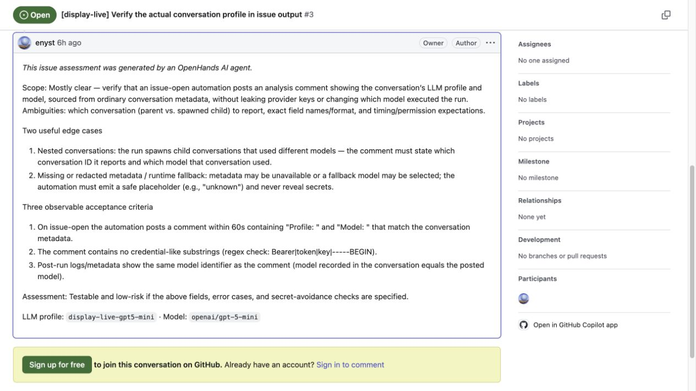

# Live issue-output evidence for PR #547

On **2026-10-05**, a real issue opened on `enyst/automation` triggered an example
automation. A real profile-backed LLM conversation assessed it and the deterministic
worker published [this GitHub comment](https://github.com/enyst/automation/issues/3#issuecomment-5998286591):

> LLM profile: `display-live-gpt5-mini` · Model: `openai/gpt-5-mini`



The tested extensions head was `b2f97183abd2717a0ff5f0f305d29965558cbcc1`.
The evidence commits added only temporary review artifacts and the design-page update.
The later merge of upstream `25aa536a3c3203ba3ffabf4e13809d7613de7b73` keeps this
record as evidence of the **2026-10-05 revision**, rather than claiming a new live run.
The source stack revisions are recorded in [revisions.json](revisions.json).
The Canvas, Agent Server and automation service used fresh isolated local state.
`enyst/automation:main` was fast-forwarded to `OpenHands/automation:main` before testing.

## What ran

1. `local-github-relay.py` noticed the newly opened real GitHub issue through the
   GitHub REST API and sent a locally signed `issues.opened` event to the automation
   service. It did not use a public tunnel or third-party relay.
2. The service dispatched `python3 issue-worker.py` with a selected agent profile.
   Its trigger and worker both restricted the test to issues in `enyst/automation`,
   opened by `enyst`, with titles beginning `[display-live]`.
3. The worker started a real conversation with that profile, no host tools, no MCP
   servers and no secret references, then waited for its issue assessment.
4. The unchanged branch `AgentConversationDispatcher.llm_provenance()` read the
   finished conversation and agent-profile listing. The unchanged reviewer
   `_with_llm_provenance()` formatted the footer.
5. The worker posted and reread the comment. The run completed successfully in
   about 33 seconds. An independent check compared the footer with the actual
   conversation model and launching profile ID/revision.

The display reader made ordinary authenticated `GET /api/conversations/{id}` and
`GET /api/agent-profiles` requests. Neither included `X-Expose-Secrets`; the metadata
contained no plaintext LLM key. The deterministic worker used a separate GitHub
publication credential; the LLM agent received no GitHub credential. See
[live-evidence.json](live-evidence.json) for sanitized request paths and identifiers,
and [verification.json](verification.json) for the independent check results.

Two initial wrapper mistakes were corrected before the successful run: the typed
event was in `envelope['event']`, and the full issue body needed a GitHub API read.
Both earlier attempts stopped before LLM execution or publication; their disposable
issues were closed. No branch display helper changed to fix those setup errors.

## Scope of this evidence

This is an **issue-open example using the branch's real display helpers**. It confirms
the current local Agent Server's metadata shape and externally visible GitHub output.
It does not run the unmodified catalog PR-reviewer `worker.py` or the manual reviewer
entrypoint, exercise overlapping/shared-bot reviews, deliver a native GitHub webhook,
or validate Slack or OpenHands Cloud. The shared-bot and failure cases still have the
regression coverage linked from the design page.

The local test was requested to inspect issue output. No Slack workspace or Cloud
automation was exercised for this test, and no live PR-review overlap test was run.
This evidence should not be read as closing every runtime-parity review request.

## Scripts and rerunning

- [issue-worker.py](issue-worker.py) is the exact successful worker, byte for byte.
- [provision-automation.py](provision-automation.py) uses the test's tarball upload and
  create/update requests, with local paths, profile ID and API URL made configurable.
  It reads the three branch helpers from the recorded test commit with `git show`,
  so it reproduces the historical test after upstream source changes are merged.
- [local-github-relay.py](local-github-relay.py) uses the test's polling/signing loop,
  with credentials, state, destination and interval made configurable.
- [bundle-source-hashes.json](bundle-source-hashes.json) records the four files
  actually bundled. The provisioner refuses to package sources whose hashes differ
  from that recorded run. The test commit must be available in the local Git clone.

Reviewers can inspect the bundle without credentials or publication:

```bash
LIVE_TEST_STATE_DIR=/tmp/pr547-bundle-check \
  python3 .pr/live-issue-test/provision-automation.py --bundle-only
tar -tzf /tmp/pr547-bundle-check/issue-analysis.tar.gz
```

To rerun the live test, use an isolated local Canvas / Agent Server / automation stack.
Configure a named LLM profile and a tools-free agent profile referencing it. Store the
GitHub comment-publication credential as the Agent Server secret
`DISPLAY_LIVE_GITHUB_TOKEN`; keep the profile's tools, MCP references and secret
references empty. This worker remains intentionally scoped to `enyst/automation`.

Set these values from your local stack, without putting credential values in files
under `.pr/`:

| Variable | Value |
| --- | --- |
| `LIVE_TEST_STATE_DIR` | A temporary output/state directory outside the checkout |
| `AUTOMATION_API_URL` | The local service base, including `/api/automation` |
| `LIVE_TEST_SESSION_API_KEY_FILE` | Your local stack's session-key file |
| `LIVE_TEST_AGENT_PROFILE_ID` | The tools-free agent profile's ID |
| `LIVE_TEST_WEBHOOK_SECRET_FILE` | File containing the GitHub signing secret configured for the local service |
| `LIVE_TEST_EVENT_URL` | The local service's `/api/automation/v1/events/{org_id}/github` endpoint |
| `GITHUB_TOKEN` | A credential that can read the test repository, used only by the relay |

Run `python3 .pr/live-issue-test/provision-automation.py`, then
`python3 .pr/live-issue-test/local-github-relay.py` in another terminal. Once the relay
prints that it is ready, open a new disposable `[display-live]` issue as `enyst`.
Existing issues are marked seen at startup and are not replayed. The service supplies
the worker's Agent Server URL/session auth, profile ID, workspace, event payload and
completion callback. Its Python runtime must be able to import this branch's bundled
helper modules. The comment footer should match the finished conversation metadata.
The worker also writes `live-evidence.json` in its run workspace.

These are temporary PR review artifacts; the repository's `.pr/` cleanup workflow
removes them on approval.
